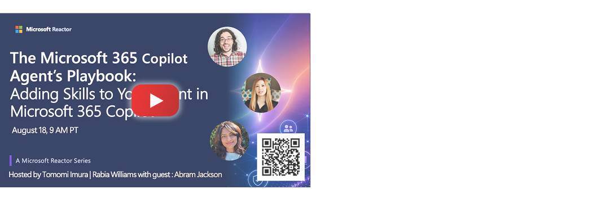

# Skill Up: Adding Skills to Your Agent in Microsoft 365 Copilot

Discover how Skills can extend Declarative Agents with new capabilities, actions, and knowledge tailored to your business scenarios. 

*Livecasted on August 18, 2026* - [Watch it on YouTube](https://www.youtube.com/watch?v=JKeNgEYv63k)

## 🤖 Quick summary - What are Declarative Agents?

- **Declarative Agent** is essentially a specialized version of Microsoft Copilot that uses the Copilot as its brain (model) and orchestrator. It inherits Microsoft 365 compliance, Responsible AI, and security standards.
- Great when you don't need complex multi-agent workflows, or autonomous behavior, and want to ship fast.
- Agent components are:
  - **Instructions** - Agent personality and behavior
  - **Knowledge** - What agent knows
  - **Actions/MCP** - What agent can call
  - **Skills** - How agent performs specialized workflows

## 👁️ Skills Overview - What are Skills?

Skills are modular, reusable packages of instructions and resources that give agents specialized domain expertise and repeatable workflows. Agents dynamically load Skills only when needed. 

A Skill is just a folder containing a SKILL.md file (instructions in plain markdown, with YAML metadata up top) plus optional scripts, templates, or reference files.

### Skills in Microsoft 365

> [!IMPORTANT]
> Skills will be available on Microsoft Copilot in coming weeks, so stay tuned!

In the world of M365, Skills as one of the capabilities of Declarative Agents.

A Declarative Agent can have one or more Skills, and each Skill can contain instructions, scripts, references, and assets. 

### What can you do with Skills? - Use-cases

- Format content nicely
- Create branded deck or letterhead 
- Load policy and extra rules (e.g. expense policy, contract review)

### Agents instructions vs. Skills

| Agent instructions | Skills |
| --- | --- |
| Loaded at the start of every conversation, no matter the task | Pulled in only when the current task matches what they cover |
| Define core behavior, tone, and boundaries | Hold detailed, specialized procedures and domain knowledge |
| Kept short and general — they apply to everything | Can be as long and deep as the task needs |

## 🤿 How to create Skills?

- [Add Skills to Declarative Agents](skills-DA.md)

## 💻 Demos & Code samples

- Fun demo: [Kitty-Explain Skill](demo-kitty-explain/README.md)
- Practical demo: [TBD]()

## 🔗 Learn More

- 📖 [Declarative Agents Overview](https://learn.microsoft.com/en-us/microsoft-365/copilot/extensibility/overview-declarative-agent)
- 📖 Create Skills for Declarative Agents - Learn doc will be available when the feature goes GA!
- 🧪 [Copilot Developer Camp - Build Declarative Agent](https://microsoft.github.io/copilot-camp/pages/extend-m365-copilot/)