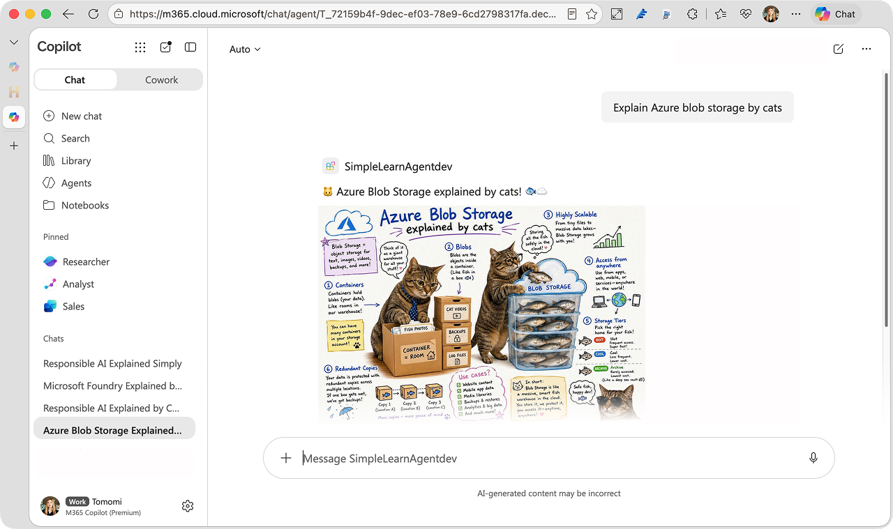

# 🐱 Skill example: Kitty Explain

**Kitty Explain** is a skill that generates a "Kitty Explain" meme-style cat visual explainer that makes complex ideas feel more approachable.



## 💎 Demo:
[📺 Watch the demo on YouTube](https://youtu.be/173fx_0X7gg)

In this demo, the skill is used with the SimpleLearn agent, which uses Microsoft Learn documentation to summarize complex topics and explain them in simple language.

Because skills are reusable packages of instructions and resources, you can also use the **Kitty Explain** skill with other agents whenever it suits the use case. Let's say I have another agent called *Explain-to-Me*, who explains content from a given URL. This skill works well with the agent.


**kitty-explain** skill contains a `SKILL.md` file (instructions in plain markdown, with YAML metadata up top) plus reference folder with cat meme images to be references.

```bash
📂 kitty-explain
    ├── 📄 SKILL.md
    └── 📂 references
      ├── 📄 kitty01.png
      ├── 📄 kitty02.png
      └── 📄 ...
```


## 💪 How to use the skill in an agent

> [!IMPORTANT]
> Skills will be available on Microsoft Copilot in coming weeks, so stay tuned!

Basically, you can just dump this folder into your agent!

- 📂 [kitty-explain](kitty-explain/)

### 🎨 Add Skill to an agent built with Agent Builder (No-Code)

Fisrt, compress the entire `kitty-explain` folder that include SKILL.md and references to create `kitty-explain.zip`.

1. Go to https://m365.cloud.microsoft/ and from the left menu, click **Agents** and create a new agent.
1. Choose your agent or create a simple agent that summarizes a given content. 
1. In the agent instruction, include a "Use skill" instruction (See below)
1. Add a sample prompt under **Suggested prompts**: Title: "Kitty Explain visual" and Message should be something similar to "Explain [content] by cats.". Make this fit to what the agent does.
1. Under **Skills**, upload a zipped **kitty-explain** skill.
1. Voilà! Test your agent now!


### ⚙️ Add Skill to an agent built with M365 Agents Toolkit

If you already have built a declarative agent using [M365 Agents Toolkit](https://marketplace.visualstudio.com/items?itemName=TeamsDevApp.ms-teams-vscode-extension), place the `kitty-explain` folder that include SKILL.md and references in your declarative agent package.

```bash
📂 your-agent
   ├── ai-plugin.json
   ├── color.png
   ├── declarativeAgent.json
   ├── instruction.txt
   ├── manifest.json
   ├── outline.png
   └── 📂 skills/
       └── 📂 kitty-explain/
           ├── 📄 SKILL.md
           └── 📂 references/
```

Then, add the "Use Skill" instruction (see below) in `instruction.txt`.

### 📜 "Use Skill" instruction example

You should add this instruction to your agent's instruction.

Either the **Agent Builder** instruction field, or in the `instruction.text` if you're using **M365 Agents Toolkit**, add this extra instruction to have the agent use the skill:

```markdown
# Use Skills

- **Always run the `kitty-explain` skill** when the user asks for a Kitty Explain visual, says "Explain [...] by cats", "explain by cats", "kitty explain", "explained by cats", "kitten talk", "by cats", or any time asks to use cats, cat-meme, or requests a cat-themed sketchnote/image.
- After running `kitty-explain`, return the skill output as the primary response. Do not replace it with a text-only explanation.
- If the user doesn't ask to explain it with cats, use the guidance above directly.
```

Modify your agent instruction to make it compatible with the skill, if you need.

