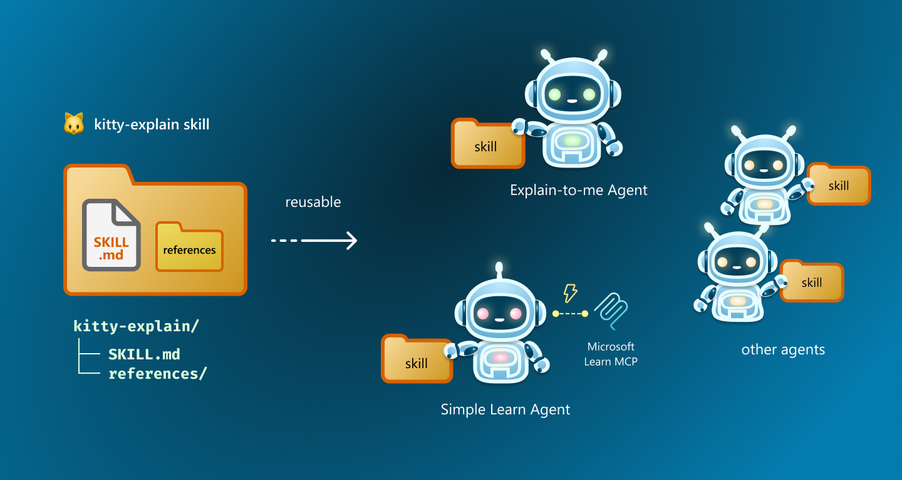
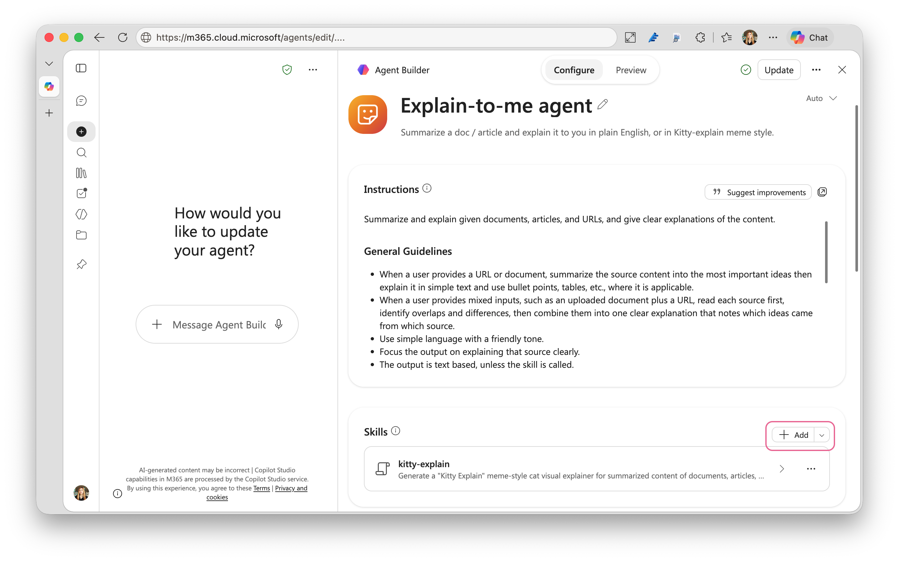

# 🐱 Skill example: Kitty Explain

**Kitty Explain** is a skill that generates a "Kitty Explain" meme-style cat visual explainer for summarized content. 

## 💎 Demo:
[](https://...)

Skills are reusable packages of instructions and resources. So, **Kitty Explain** skill can be used with any agents too, especially it works well with agents that summarize some content from uploaded documents, URLs of articles, or concepts. 



**kitty-explain** skill contains a `SKILL.md` file (instructions in plain markdown, with YAML metadata up top) plus reference folder with cat meme images to be references.

```bash
📂 kitty-explain
    ├── 📄 SKILL.md
    └── 📂 references
      ├── 📄 kitty01.png
      ├── 📄 kitty02.png
      └── 📄 ...
```


## 💻  Source Code

- 📄 [SKILL.md](kitty-explain/SKILL.md)

## 💪 How to use the skill in an agent

### 🎨 Create with Agent Builder (No-Code)

1. Go to https://m365.cloud.microsoft/ and from the left menu, click **Agents** and create a new agent.
1. Create a simple agent that summarizes a given content. Or start with a template. Choose **Document Summary** or **Expert Answers**.
1. Add (or modify) an instruction. Then, include a "Use skill" instruction. (See below)
1. Add a sample prompt under **Suggested prompts**: Title: "Kitty Explain visual" and Message should be something similar to "Explain [concept] by cats.". Make this fit to what the agent does.
1. Under **Skills**, upload a zipped **kitty-explain** skill.
1. Voilà!



### ⚙️ If you already have built a declarative agent in Agents Toolkit

Place the `kitty-explain` folder that include SKILL.md and references in your declarative agent package.

```bash
📂 your-agent
   ├── ai-plugin.json
   ├── color.png
   ├── declarativeAgent.json
   ├── instruction.txt
   ├── manifest.json
   ├── outline.png
   └── 📂 skills
       └── 📂 kitty-explain
           ├── 📄 SKILL.md
           └── 📂 references
```

#### 📜 Use Skill instruction example

```markdown
# Use Skills

- **Always run the `kitty-explain` skill** when the user asks for a Kitty Explain visual, says "Explain the content by cats", "explain by cats", "kitty explain", "explained by cats", "kitten talk", or any time asks to use cats, cat-meme, or requests a cat-themed sketchnote/image.
- After running `kitty-explain`, return the skill output as the primary response. Do not replace it with a text-only explanation unless the user asks for text instead.
- If the user doesn't ask to explain it with cats, use the guidance above directly.
```