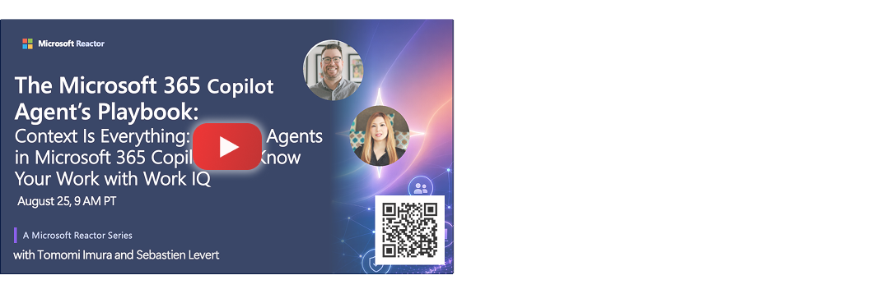
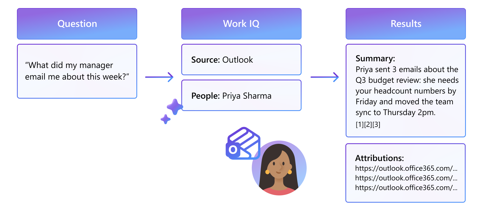
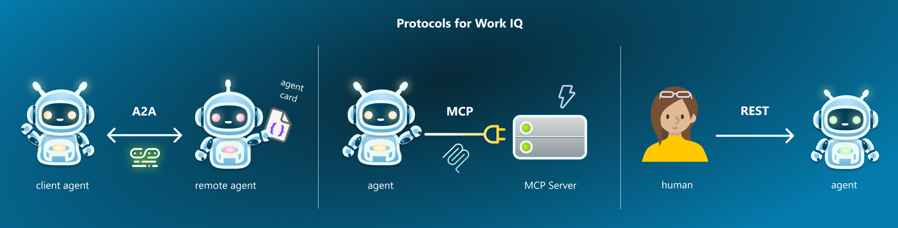

# Context Is Everything: Building Agents That Know Your Work Context

Learn how Work IQ helps agents understand the people, projects, and information that matter most in your organization.

[](https://...)

📅 Video will be available after **August 25, 2026** 


## 👁️ Overview - What is Work IQ?

Work IQ is the "brain" behind your organizational intelligence and understands context, relationships, and work patterns. It pulls signals from emails, chats, meetings, and documents to build a semantic understanding of how you work, not just what data you have.


Work IQ is made of:

- **Chat** experience optimized for conversational intelligence.
- **Context** to understand your preferences, your working style, and how you want responses to be delivered.
- **Tools** to enable agents to provide more relevant answers and perform composable actions in ways that match your habits and expectations.
- **Workspaces** optimized for long-running agent workflows and to support reliable tasks progression.

## Retrieval with Work IQ

Work IQ grounds the answer for you, not just dumping you raw data.

If you ask Work IQ, "What did my manager email me about this week?", it doesn't just dump three raw emails and walk away. 

It actually tells you: "Priya sent 3 emails about the Q3 budget review — she needs your headcount numbers by Friday, and she moved the team sync to Thursday at 2pm."
And it links straight back to those emails in Outlook, so I can verify it myself.



### Protocols

Work IQ supports three protocols to interact: 

- **A2A** — **Agent to Agent** for multi-agent orchestration
- **MCP** - **Agent to Tool**, using MCP, where Work IQ acts as a plug-in capability
- **REST** - **Human to Agent** via REST for user-facing apps



###  Command Line tools

- Work IQ CLI
- GitHub Copilot CLI with Work IQ plugin

In GitHub Copilot CLI, ask with natural language:

```txt
Find the most recent PowerPoint files that I modified
```

## Building Agents with WIQD

You can build Work IQ-enabled agents using **Work IQ Developer Tool**, or you can call it WIQD (pronouced "wicked"), which is a unified toolset that helps you build, validate, publish, and manage Microsoft 365 Copilot agents and extensions from a single workflow. 

### Examples with WIQD in GitHub Copilot CLI

You can build an agent using natural language when using WIQD within GitHub Copilot.

```bash
> copilot --agent wiqd:wiqd
```

Then, in GitHub Copilot CLI:

**Create an agent**
```txt
Create a new declarative agent called Photobooth that accepts user-uploaded images and creates photobooth-style image responses. Apply creative filters such as black-and-white, sepia, pop-art, and sketch…
```

**Provision**
```txt
Open the provisioned agent in Microsoft 365 Copilot with wiqd.
```


## Demos & Code samples

- Demo: [TBD]()

## 🔗 Learn More

- 📖 Microsoft Learn doc - [Work IQ Overview](https://learn.microsoft.com/en-us/microsoft-365/copilot/extensibility/work-iq/)
- 🧪 Copilot Developer Camp - [Build with Work IQ](https://microsoft.github.io/copilot-camp/pages/work-iq/)
- 💻 [Work IQ samples](https://github.com/microsoft/work-iq-samples) on GitHub
- ⚙️ [Work IQ Dev Tool Docs](https://microsoft.github.io/wiqd/)
- 🍳 [Work IQ Cookbook](https://aka.ms/wiqd/cookbooks)

