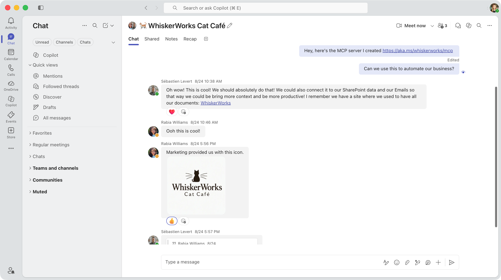
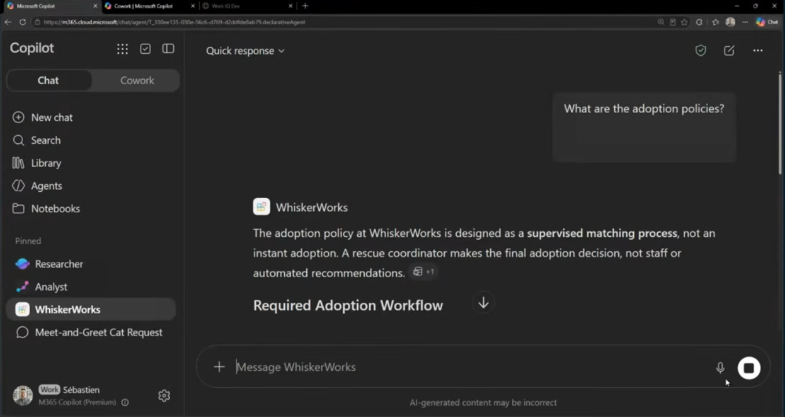

# 🐱 Streamline your workload with WIQD: WhiskerWorks Cat Cafe

[Watch the demo on YouTube](https://www.youtube.com/watch?v=eEXW-sUAnSs)

## Senario

Séb, Tomomi, and Rabia work at WhiskerWorks Cat Cafe and are exploring ways to automate their business with AI. They discuss their ideas in a Teams chat, with an MCP server already available at `aka.ms/whiskerworks/mcp` to get them started.



## Agentic development: Build an end-to-end agent with WIQD

You don't need to create every configuration file, schema, and skill definition by hand. Simply describe the business challenge in natural language, and the tools will generate much of the initial agent structure for you.

### From a Teams chat to an agent specification and code scaffold

Use **WIQD** with **GitHub Copilot CLI** to build plugins and agents through natural-language prompts. **Work IQ** grounds the process in your Teams conversations, helping the generated agent reflect the context of your work.

First, login to GitHub Copilot CLI and use WIQD:

```bash
> copilot --agent wiqd:wiqd
```

Then within GitHub Copilot CLI, ask WIQD to build the agent. 
This is what Séb tells WIQD:

```txt
Rabia, Tomomi, and I have been talking about building some Copilot plugins and agents for out WhiskerWorks Cat Cafe business so we can use them in both Copilot chat and Cowork. First, write a spec based on the entire content of the chat and them build it as a new Copilot extention using WIQD!
```

GitHub Copilot analyzes the requirements, then uses Work IQ and WIQD to locate the relevant chat, MCP server, and company logo. With this context, it generates the project's code scaffold from scratch:

- Declarative agent configuration
- Agent instructions
- Icon
- Skill
- Agent connector with MCP endpoint
- Supporting code artifacts

### Try it on Microsoft 365 Copilot

Have WIQD to provision

```txt
Can you provision the dev environment so I can test it
```
This will provision the dev environment, and register tenant resourses to write `.env\.env.dev`. Then it will give you the M365 Copilot chat link so you can open it on browser.

Ta-da 🤗



### More with Copilot Cowork, Skills, and MCP UI

The agent has more Work IQ-powered capabilities.

Work IQ can assemble organizational context and create higher-value outputs than simple search. For example:

- Weekly briefings
- Skill-driven automation
- Task orchestration
- Context-aware agent assistance

The broader theme is that Work IQ is not just document retrieval. It creates a permission-aware understanding of people, projects, meetings, conversations, and documents, and uses those relationships when helping a user.

One of the recurring messages is that Work IQ provides grounded synthesis rather than returning disconnected search results!

### Evaluations, Publishing, Monitoring, and Lifecycle Management

WIQD supports the entire development lifecycle rather than just code generation, such as:

- Running evaluations
- Validating quality
- Publishing agents
- Monitoring behavior
- Managing agent updates
