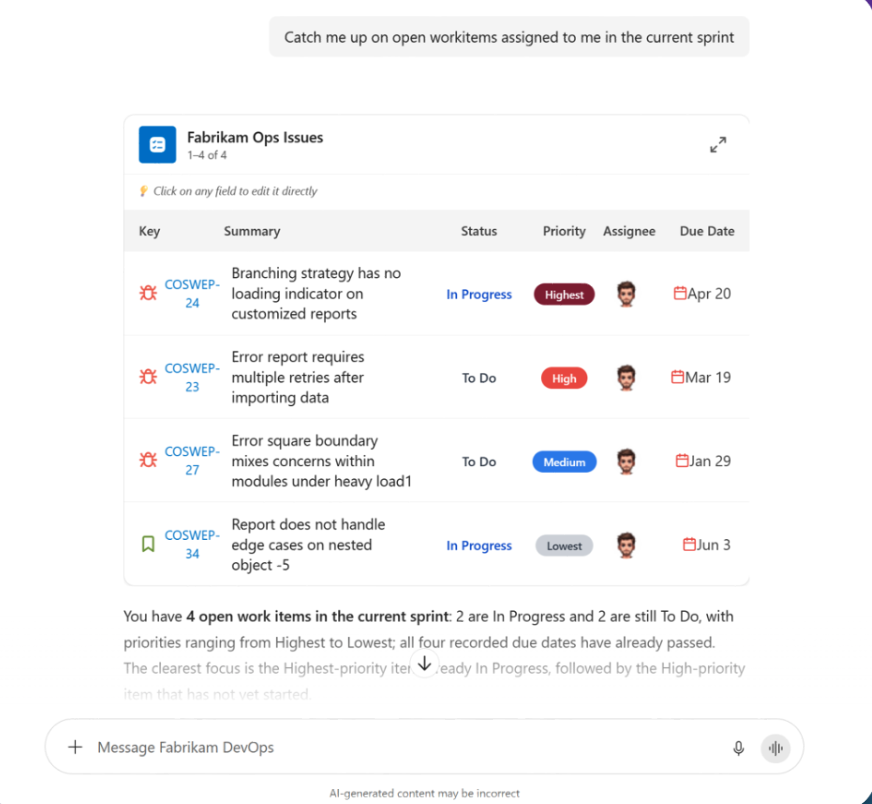

# MCP Apps: Bringing Interactive UI to Microsoft 365 Copilot

Go beyond chat by connecting MCP Apps to Declarative Agents and delivering rich, interactive experiences directly inside Microsoft 365 Copilot. 

This episode explores how MCP Apps transform Copilot from a conversational interface into an interactive workspace where users can view, edit, review, and confirm actions without switching between applications. MCP Apps allow developers to bring rich UI experiences into Copilot while continuing to use the open MCP standard. 

)

Livecasted on September 1, 2026 - [Watch it on YouTube](https://www.youtube.com/watch?v=Gvp6yQFVySw)

## What Are MCP Apps?
An MCP App is a backward-compatible extension to the Model Context Protocol that enables MCP servers to provide interactive HTML-based user interfaces in addition to data and tool responses. 

With MCP Apps:

- MCP servers can provide both data and UI.
- User interfaces are rendered safely inside sandboxed iframes.
- Communication between the UI and the host happens through MCP JSON-RPC.
- The same MCP App can work across multiple hosts that support the standard.
- Microsoft 365 Copilot supports MCP Apps through MCP-based actions in declarative agents. 

## Why This Matters
Traditional AI interactions often result in long text responses that users must manually interpret and act on. MCP Apps enable:

- Rich visual experiences instead of walls of text.
- Task-specific interfaces embedded directly in the workflow.
- Reduced context switching between applications.
- Reusable experiences across multiple MCP-compatible hosts.
- Secure interaction using Entra ID SSO or OAuth 2.1 authentication.
In short, MCP Apps make conversations actionable.

Use MCP Apps when you need:
- 📊 Interactive analytics and dashboards
- 🗺️ Complex data exploration
- 📝 Large configuration forms
- 🎥 Rich media viewers
- 📈 Real-time monitoring
- ✅ Multi-step workflows and approvals

## How MCP Apps Work

The MCP Apps runtime follows a simple flow:

1. **Declare the UI** - The MCP tool metadata points to a `ui://` HTML resource that defines the user interface. 
2. **Fetch the Template** - The host preloads the HTML resource before it is needed.
3. **Invoke the Tool** - The agent calls the MCP tool, and the server returns structured data. 
4. **Render Securely** - Microsoft 365 Copilot renders the UI in a sandboxed iframe inside the chat experience.
5. **Enable Interaction** - The UI and host exchange messages through MCP JSON-RPC, allowing users to interact with data and trigger actions.

## Interactive UI in Copilot in Action

⭐️ Use-cases and examples: [aka.ms/mcp-app-samples](https://aka.ms/mcp-app-samples)

## Microsoft 365 Copilot Integration Requirements

**Authentication**

Production deployments should use:

- OAuth 2.1
- Microsoft Entra Single Sign-On (SSO)

Anonymous access should be limited to development scenarios.

**Content Security Policy (CSP)**

Widgets should declare CSP metadata to control:

- API connectivity
- Approved external resources
- Allowed domains

**CORS and Allowed URLs**

Applications must:

- Allow Copilot widget renderer origins.
- Configure required OAuth and SSO redirect URLs.
- Support approved API endpoints.

## Build an MCP App with Interactive Widgets

⭐️ Instruction on [Copilot Developer Camp](https://microsoft.github.io/copilot-camp/pages/extend-m365-copilot/11-mcp-app/)!

---

## 🔗 Links

- 🧪 [Copilot Developer Camp - Build an MCP App with Interactive Widgets]([aka.ms/mcp-app-lab](https://microsoft.github.io/copilot-camp/pages/extend-m365-copilot/11-mcp-app/))
- 🧫 [MCP App Samples](aka.ms/mcp-app-samples)
