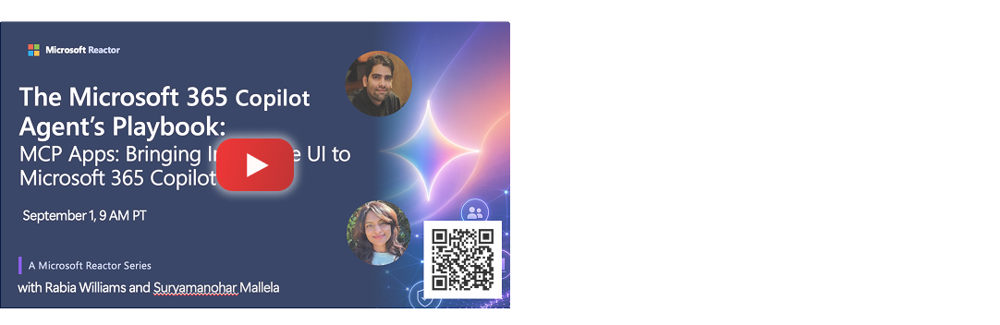

# MCP Apps: Bringing Interactive UI to Microsoft 365 Copilot

Go beyond chat by connecting MCP Apps to Declarative Agents and delivering rich, interactive experiences directly inside Microsoft 365 Copilot. 

📅 Video will be available after **September 1, 2026** 

## 🔗 Learn More

- 📖 [Add action with MCP](https://learn.microsoft.com/en-us/microsoft-365/copilot/extensibility/build-mcp-plugins)
- 🧪 [Copilot Developer Camp - Connect Declarative Agent to MCP Server](https://microsoft.github.io/copilot-camp/pages/extend-m365-copilot/bundle-a/)