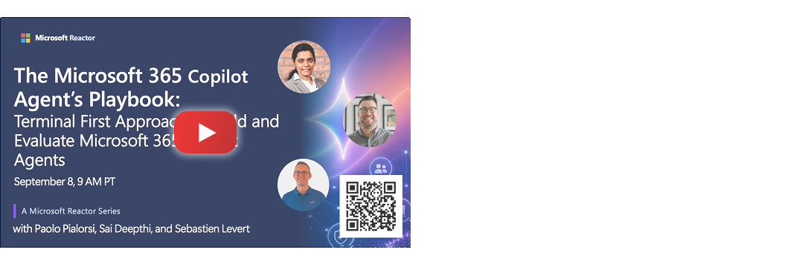

# Terminal First Approach to Build and Evaluate Microsoft 365 Copilot Agents

Explore a developer-first approach to building and evaluating agents using M365 Agent Evals and skill-based tooling. From the command line to production readiness, learn how to test, measure, and improve agent quality with confidence. 

📅 Video will be available after **September 8, 2026** 

## 👁️ Overview 

## 🤿 Deep Dive

- 

### Demos & Code samples

- Demo: [Demo title]()

## 🔗 Learn More

- 📖 [Agent evaluation overview](https://learn.microsoft.com/en-us/microsoft-365/copilot/extensibility/evaluation-overview)
