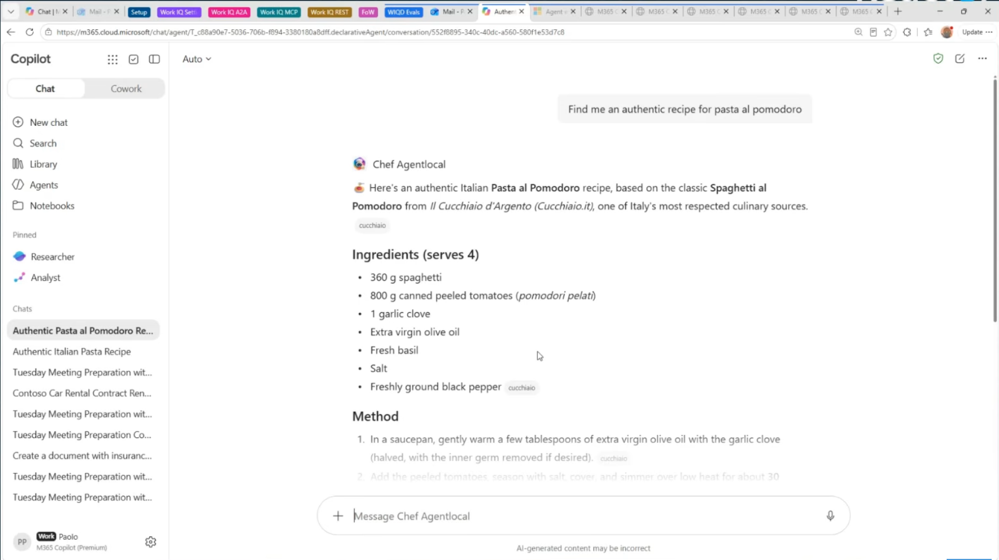

# Terminal First Approach to Build and Evaluate Microsoft 365 Copilot Agents

Explore a developer-first approach to building and evaluating agents using M365 Agent Evals and skill-based tooling. From the command line to production readiness, learn how to test, measure, and improve agent quality with confidence. 

[](https://www.youtube.com/watch?v=TrUFY4P5s-c)

Livecasted on September 8, 2026 - [Watch it on YouTube](https://www.youtube.com/watch?v=TrUFY4P5s-c)

## Evaluate Microsoft 365 Copilot Agents with Work IQ Developer Tool

*Work IQ Developer Tools (WIQD)* is a toolset designed to help developers build and manage plugins and AI agents for Microsoft 365 Copilot within a single, unified lifecycle:

```text
Create → Edit → Validate → Provision → Package → Publish → Monitor
                   ↑                                          │
                   └──────────────── Iterate ─────────────────┘         
```

## Demo

**Chef Agent** is an agent that provides recipes for Italian food 🍝

You can build by using **WIQD**, and here's the generated code:

🧑‍🍳 [**Chef Agent**](aka.ms/mcp-app-samples) 



## 🔗 Learn More

- 📖 [Agent evaluation overview](https://learn.microsoft.com/en-us/microsoft-365/copilot/extensibility/evaluation-overview)
- ⚙️ [Work IQ Dev Tool Docs](https://microsoft.github.io/wiqd/)
- 🍳 [Work IQ Cookbook](https://aka.ms/wiqd/cookbooks)
