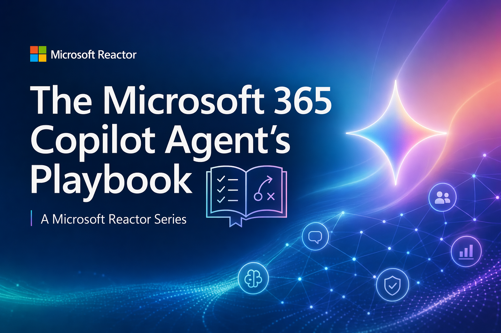

# Microsoft 365 Copilot Agents Playbook

A practical series on building, grounding, extending, and evaluating AI agents.

Each section contains a recorded livestream video and supplemental materials to help you understand how modern Microsoft 365 Copilot agents like declarative agents are built, grounded, extended, and evaluated.

## 📚 What You'll Learn

Whether you're just getting started or already building on Microsoft 365, you'll learn practical techniques for adding skills, grounding agents with organizational context through WorkIQ, creating rich experiences with MCP apps, and evaluating agent quality with developer tools and modern evaluation workflows.

- **Extend** agents with Skills and actions 
- **Ground** agents with enterprise context using WorkIQ 
- **Connect** MCP apps for interactive user experiences 
- **Evaluate** and improve agent quality with Microsoft 365 Copilot Evals

### 🗂️ Prerequisites

- Microsoft 365 Developer Program sandbox subscription and Microsoft 365 Copilot license
- Global Admin access in your M365 tenant, required to configure tenant-wide app and policy settings

Please refer [Set up your development environment for Microsoft 365 Copilot](https://learn.microsoft.com/en-us/microsoft-365/copilot/extensibility/prerequisites#prerequisites) on Learn documentation.

**Microsoft 365 Agent Toolkit Requirement:**

- [Node.js](https://nodejs.org/), supported versions: 22
- [Microsoft 365 Agents Toolkit Visual Studio Code Extension](https://aka.ms/teams-toolkit) version 5.0.0 and higher or [Microsoft 365 Agents Toolkit CLI](https://aka.ms/teamsfx-toolkit-cli)

## Episodes

| **Episode** | **Description** | 
|-------------|-----------------|
| [Skill Up: Adding Skills to Your Agent in Microsoft 365 Copilot](./01-extend/README.md)  | Discover how Skills can extend Declarative Agents with new capabilities, actions, and knowledge tailored to your business scenarios. |              
| [Context Is Everything: Building Agents That Know Your Work Context](./02-ground/README.md)  | Learn how Work IQ helps agents understand the people, projects, and information that matter most in your organization. | 
| [MCP Apps: Bringing Interactive UI to Microsoft 365 Copilot](./03-connect/README.md) | Go beyond chat by connecting MCP Apps to Declarative Agents and delivering rich, interactive experiences directly inside Microsoft 365 Copilot. | 
| [Terminal First Approach to Build and Evaluate Microsoft 365 Copilot Agents](./04-evaluate/README.md) | Explore a developer-first approach to building and evaluating agents using M365 Agent Evals and skill-based tooling. | 

